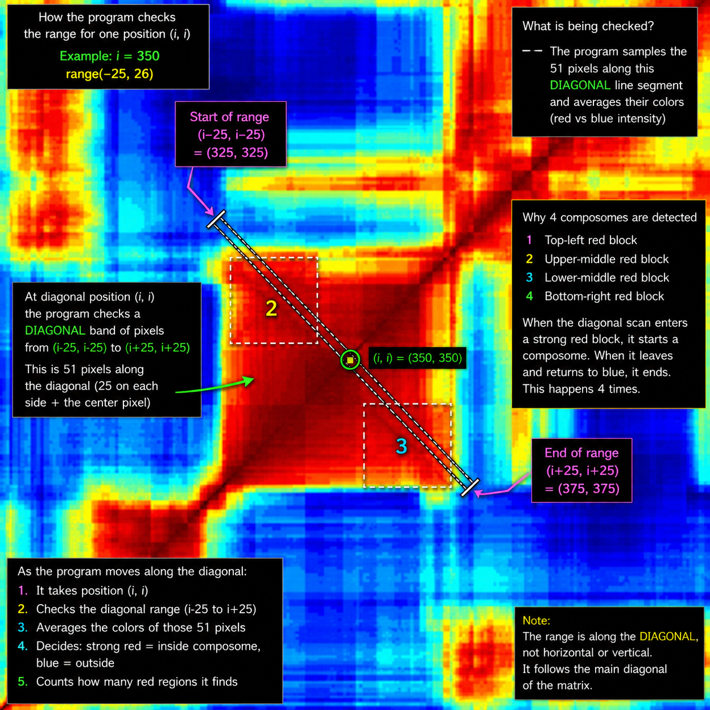

# Day 05 - Composome Detection

## Description

This program analyzes a carpet plot image from the lab and detects composome regions (A composome is a self-reproducing compositional assembly of amphiphilic molecules that maintains its internal chemical proportions during catalytic growth and fission. Unlike sequence-based replicators like RNA, it transmits primordial information solely through a homeostatic network of molecular concentrations).

The carpet plot is a similarity matrix:
- red/yellow areas represent similar compositions
- blue areas represent less similar compositions

Large red/yellow squares along the diagonal correspond to composomes.

The program:
- opens the image
- scans the diagonal region
- compares red intensity to blue intensity
- detects composome blocks
- counts red and non-red regions

## Example of composome regions

 It should identify 4 composomes which it does.

 The program detected 4 major composome blocks along the diagonal of the carpet plot.
 However, the first and fourth composomes appear to belong to the same composome family because there are strong red/yellow regions connecting them away from the diagonal.

 This indicates that these two composomes have similar compositions even though they appear in different positions on the diagonal. Writing into the program the ability to detect this seemed too advanced to me.

 I also wanted the counts to add clarity that it actually checks the whole width to make sure it goes over it all since the image is 366 pixels wide this seems to result correctly when adding up red and non-red regions.

---

## Files

- image_analysis.py  
  Main analysis program

- test_image_analysis.py  
  Automated tests

- composition_carpetplot.png  
  Input image from the lab

- requirements.txt  
  Required Python libraries

## ChatGPT
I used various prompts to help with this. At first I asked it to help create an image analysis program based on pixels but had to refine my prompts since I needed to look at pixels for the under diagonal line only and also concentrate on those on the off diagonal to confirm composome.